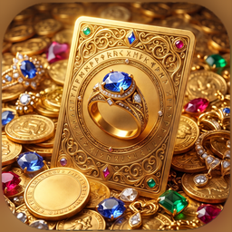
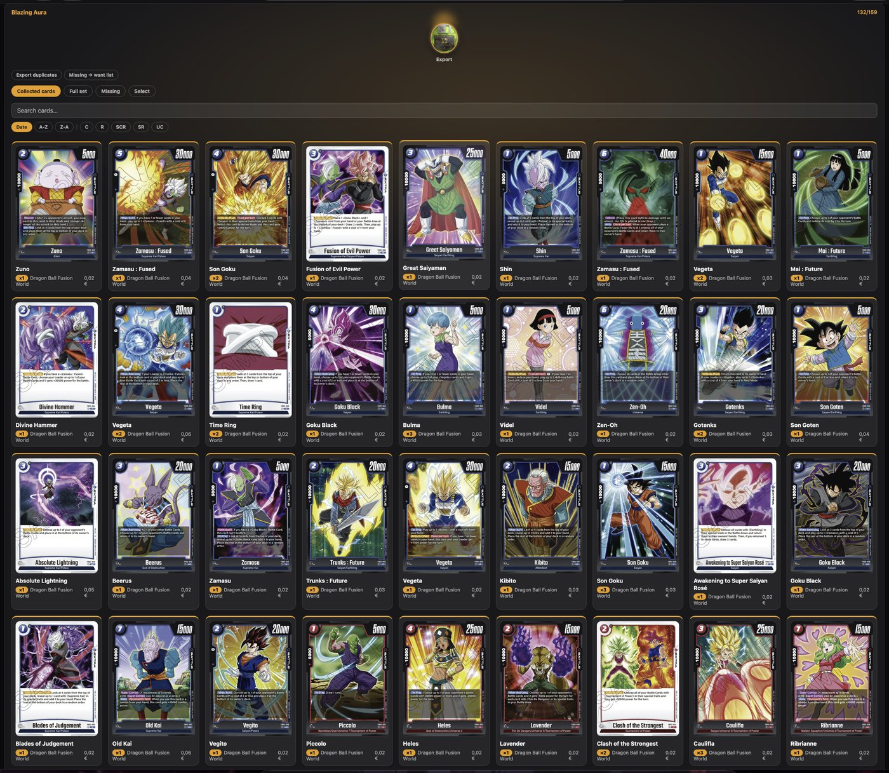
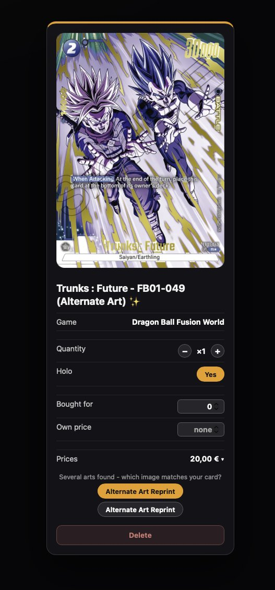
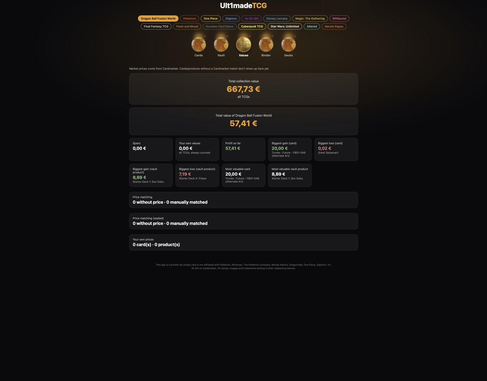
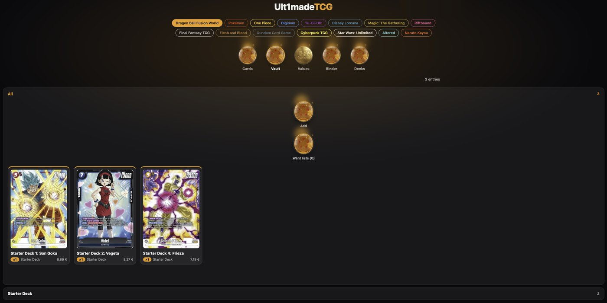
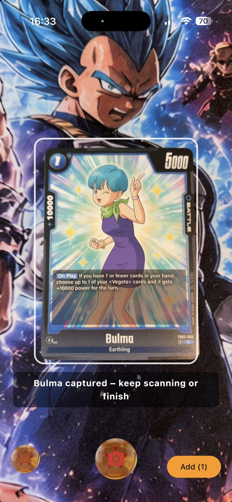
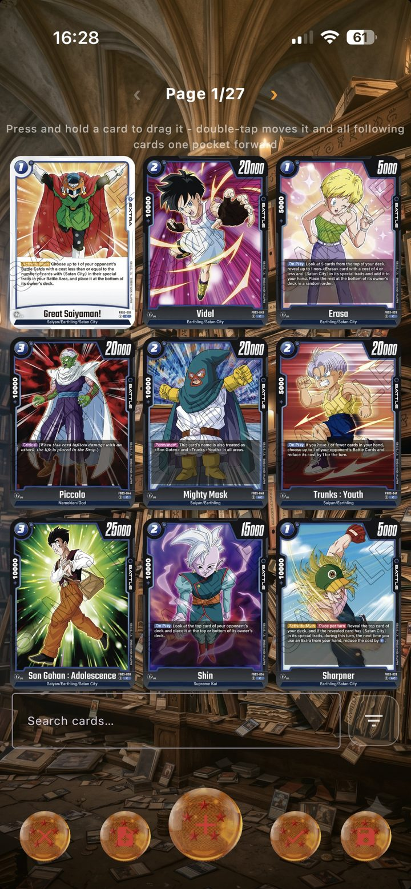

<p align="center"></p>

# Ult1made TCG — Self-hosted Server

The companion server for [Ult1made TCG](https://ult1madetcg.com) — the
multi-TCG collection app for iOS and Android. Run it on your own hardware
(Raspberry Pi, NAS, any Linux box) to sync\* all your devices two-way and
get a full web interface for the big screen.

**Your data stays yours:** there is no central cloud and there never will
be. Every server instance belongs to the person running it.

\*Two-way sync between the app and your server requires the app's Premium
subscription (1.99 €/month — costs about as much as a cheap coffee). The
server itself is free, and you don't need the app to run it.

## What it looks like

The web interface - your whole collection on the big screen, here a
Dragon Ball Fusion World set with its collection progress:

<p align="center"></p>

<p align="center">
  
  
</p>

<p align="center"></p>

The companion app for iOS and Android, which syncs with your server:

<p align="center">
  
  
</p>

## Quick start (Docker, Linux)

```bash
git clone <this repo>
cd ult1made-server
docker compose up -d --build
```

The web interface then runs on port 8080. Open it, note the IP address and
pairing token shown at the top, and enter both in the app under
Settings → Server. On the same network the app usually discovers the
server automatically (mDNS - this is why docker-compose uses host
networking, which requires Linux).

Your data lives in the `ult1made-data` Docker volume and survives
rebuilds and updates.

## Updating

```bash
git pull
docker compose up -d --build
```

## Without Docker

Requires JDK 11+:

```bash
./gradlew :server:installDist
./server/build/install/server/bin/server
```

Configuration via environment variables: `PORT` (default 8080),
`DB_PATH`, `CUSTOM_PHOTOS_DIR`, `IMAGE_CACHE_DIR`.

## Documentation

The full user handbook (German/English, including the server chapter):
https://ult1madetcg.com/anleitung.html

## License

Copyright (C) 2026 Christian Meyer

This server is free software, licensed under the **GNU Affero General
Public License v3.0** (see [LICENSE](LICENSE)). You may run, study, modify
and share it. If you modify it and make it available to others - including
as a hosted service - you must publish your modified source under the same
license. The mobile app is a separate, proprietary product.
